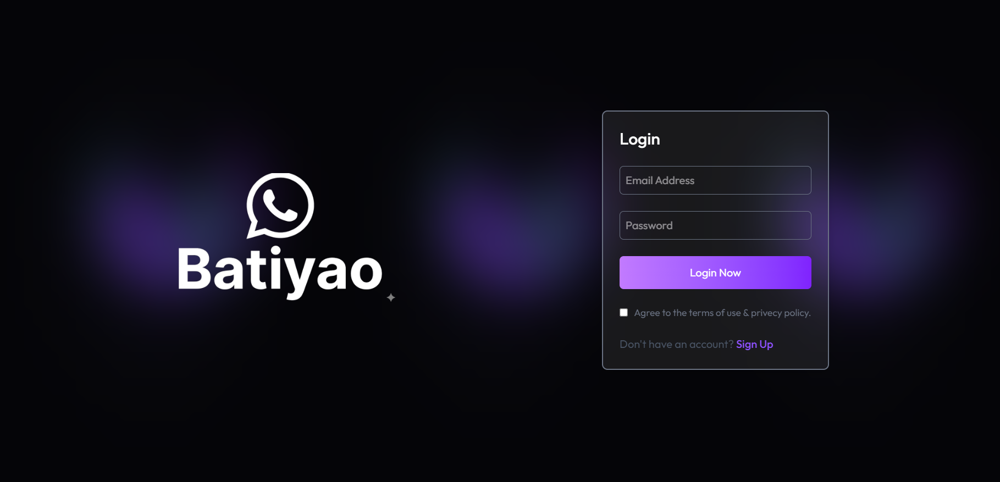
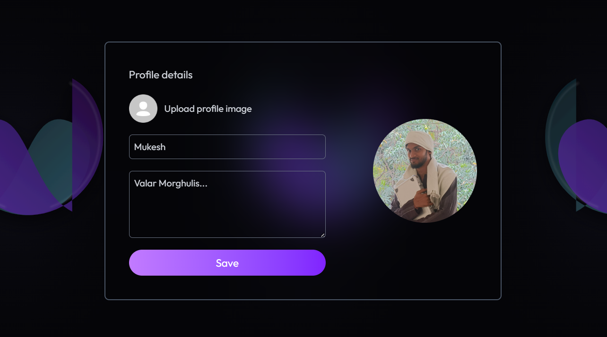

<div align="center">

# 💬 Batiyao — Real-Time Chat Application

A full-stack real-time chat application built with the MERN stack and Socket.io. Send messages, share images, see who's online, and manage your profile — all in real time.

[](https://react.dev)
[](https://nodejs.org)
[](https://mongodb.com)
[](https://socket.io)
[](https://tailwindcss.com)

</div>

---

## ✨ Features

- 🔐 **JWT Authentication** — Secure signup, login, and session persistence via `localStorage`
- 💬 **Real-Time Messaging** — Instant message delivery powered by Socket.io WebSockets
- 🖼️ **Image Sharing** — Send images in chat with Cloudinary cloud storage
- 🟢 **Online Presence** — See which users are currently online in real time
- 👁️ **Seen / Unseen Messages** — Unread message count badges per user in the sidebar
- 🙍 **Profile Management** — Update your name, bio, and profile picture
- 📱 **Responsive Design** — Mobile-friendly layout with adaptive sidebar behavior
- ⚡ **Loading Skeletons** — Smooth skeleton UI while messages load between chat switches
- 🔒 **Protected Routes** — Frontend and backend route protection for authenticated users only

---

## 🛠️ Tech Stack

### Frontend — `client/`
| Technology | Version | Purpose |
|---|---|---|
| React | 19 | UI framework |
| Vite | 7 | Build tool & dev server |
| TailwindCSS | 4 | Utility-first styling |
| Axios | 1.13 | HTTP requests |
| Socket.io-client | 4.8 | Real-time WebSocket communication |
| React Router DOM | 7 | Client-side routing |
| React Hot Toast | 2.6 | Toast notifications |

### Backend — `server/`
| Technology | Version | Purpose |
|---|---|---|
| Node.js + Express | 5 | REST API server |
| Socket.io | 4.8 | WebSocket server |
| MongoDB + Mongoose | 9 | Database & ODM |
| JSON Web Token | 9 | Authentication tokens |
| bcryptjs | 3 | Password hashing |
| Cloudinary | 2.8 | Image upload & storage |
| dotenv | 17 | Environment variable management |

---

## 📁 Project Structure

```
batiyao/
│
├── client/                         # React frontend (Vite)
│   ├── context/
│   │   ├── AuthContext.jsx          # Auth state, login/logout, socket connection
│   │   └── ChatContext.jsx          # Messages, users, real-time subscriptions
│   ├── src/
│   │   ├── components/
│   │   │   ├── Sidebar.jsx          # User list with online indicators & unseen badges
│   │   │   ├── ChatContainer.jsx    # Chat area with message rendering & input
│   │   │   └── RightSidebar.jsx     # Selected user info & shared media
│   │   ├── pages/
│   │   │   ├── HomePage.jsx         # Main layout (Sidebar + Chat + RightSidebar)
│   │   │   ├── LoginPage.jsx        # Login & Signup form
│   │   │   └── ProfilePage.jsx      # Edit name, bio, profile picture
│   │   ├── assets/
│   │   │   └── assets.js            # Centralized asset imports
│   │   └── lib/
│   │       └── utils.js             # Helper functions (e.g. formatMessageTime)
│   ├── .env                         # VITE_BACKEND_URL
│   └── vercel.json                  # Vercel SPA rewrite config
│
└── server/                          # Node.js + Express backend
    ├── controllers/
    │   ├── userController.js        # signup, login, updateProfile, checkAuth
    │   └── messageController.js     # getUsers, getMessages, sendMessage, markSeen
    ├── routes/
    │   ├── userRoutes.js            # /api/auth/*
    │   └── messageRoutes.js         # /api/messages/*
    ├── middleware/
    │   └── auth.js                  # JWT protectRoute middleware
    ├── models/
    │   ├── User.js                  # User schema
    │   └── message.js               # Message schema
    ├── lib/
    │   ├── db.js                    # MongoDB connection
    │   ├── cloudinary.js            # Cloudinary config
    │   └── utils.js                 # generateToken helper
    └── server.js                    # Express app, Socket.io setup, server entry
```

---

## 🚀 Getting Started

### Prerequisites

- Node.js `>= 20.19.0`
- MongoDB Atlas account (or local MongoDB)
- Cloudinary account

### 1. Clone the repository

```bash
git clone https://github.com/your-username/batiyao.git
cd batiyao
```

### 2. Setup the Server

```bash
cd server
npm install
```

Create a `.env` file in the `server/` directory:

```env
PORT=5000
MONGODB_URI=your_mongodb_connection_string
JWT_SECRET=your_jwt_secret_key
CLOUDINARY_CLOUD_NAME=your_cloudinary_cloud_name
CLOUDINARY_API_KEY=your_cloudinary_api_key
CLOUDINARY_API_SECRET=your_cloudinary_api_secret
FRONTEND_URL=http://localhost:5173
```

Start the server:

```bash
npm run server      # development (nodemon)
# or
npm start           # production
```

### 3. Setup the Client

```bash
cd client
npm install
```

Create a `.env` file in the `client/` directory:

```env
VITE_BACKEND_URL=http://localhost:5000
```

Start the dev server:

```bash
npm run dev
```

The app will be available at `http://localhost:5173`.

---

## 🌐 API Reference

### Auth Routes — `/api/auth`

| Method | Endpoint | Auth | Description |
|--------|----------|------|-------------|
| `POST` | `/signup` | ❌ | Register a new user |
| `POST` | `/login` | ❌ | Login and receive JWT token |
| `PUT` | `/update-profile` | ✅ | Update name, bio, profile picture |
| `GET` | `/check` | ✅ | Verify token and return current user |

### Message Routes — `/api/messages`

| Method | Endpoint | Auth | Description |
|--------|----------|------|-------------|
| `GET` | `/users` | ✅ | Get all users except the logged-in user |
| `GET` | `/:id` | ✅ | Get conversation with a specific user |
| `POST` | `/send/:id` | ✅ | Send a text or image message |
| `PUT` | `/mark/:id` | ✅ | Mark a specific message as seen |

---

## ⚡ Real-Time Events (Socket.io)

| Event | Direction | Description |
|-------|-----------|-------------|
| `getOnlineUsers` | Server → Client | Broadcasts updated list of online user IDs |
| `newMessage` | Server → Client | Pushes a new message to the receiver's socket |

---

## 🔑 Environment Variables

### Server (`server/.env`)

| Variable | Description |
|----------|-------------|
| `PORT` | Port for the Express server (default: 5000) |
| `MONGODB_URI` | MongoDB Atlas connection string |
| `JWT_SECRET` | Secret key for signing JWT tokens |
| `CLOUDINARY_CLOUD_NAME` | Cloudinary cloud name |
| `CLOUDINARY_API_KEY` | Cloudinary API key |
| `CLOUDINARY_API_SECRET` | Cloudinary API secret |
| `FRONTEND_URL` | Allowed origin for CORS (your deployed frontend URL) |

### Client (`client/.env`)

| Variable | Description |
|----------|-------------|
| `VITE_BACKEND_URL` | Backend API base URL |

> ⚠️ Never commit `.env` files to your repository. Add them to `.gitignore`.

---

## 🚢 Deployment

### Backend — Render / Railway

1. Push your `server/` code to GitHub
2. Create a new Web Service on [Render](https://render.com) or [Railway](https://railway.app)
3. Set the **build command** to `npm install` and **start command** to `npm start`
4. Add all environment variables from `server/.env` in the platform dashboard
5. Set `FRONTEND_URL` to your deployed Vercel frontend URL

### Frontend — Vercel

1. Push your `client/` code to GitHub
2. Import the project on [Vercel](https://vercel.com)
3. Set the **root directory** to `client`
4. Add `VITE_BACKEND_URL` as an environment variable pointing to your Render/Railway backend URL
5. The `vercel.json` file handles SPA routing rewrites automatically

---

## 🧠 Key Implementation Notes

- **Socket connection guard** uses `useRef` instead of `useState` to prevent stale closure issues when checking if a socket is already connected
- **Message loading** clears previous messages immediately on user switch to avoid showing stale chat content
- **Login form** uses an `isLoading` state to disable the submit button during API calls, preventing duplicate requests
- **Password exclusion** — the login and signup API responses use `.toObject()` + destructuring to strip the hashed password before sending user data to the frontend
- **Sidebar users** are filtered server-side using `{ _id: { $ne: req.user._id } }` so the logged-in user never appears in their own chat list

---

## 📸 Screenshots

## 📸 Screenshots

| Login Page | Chat View |
|---|---|
|  |  |

| Profile Page |
|---|
|  |

Login Page    →  ./screenshots/Login.png
Home Page     →  / (Sidebar + ChatContainer + RightSidebar)
Profile Page  →  /profile


---

## 👨‍💻 Author

**Mukesh**

- GitHub: [@mukeshkr59](https://github.com/mukeshkr59)
- LinkedIn: [mukesh-kumar-vishwakarma]([https://linkedin.com/in/your-linkedin](https://www.linkedin.com/in/mukesh-kumar-vishwakarma/))

---

## 📄 License

This project is open source and available under the [MIT License](LICENSE).

---

<div align="center">
  Built with ❤️ using React, Node.js, Socket.io & MongoDB
</div>
